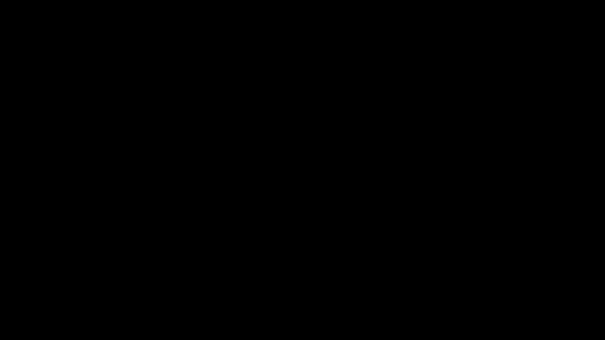
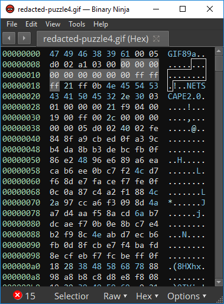
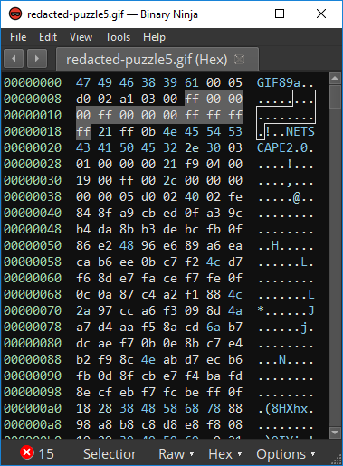
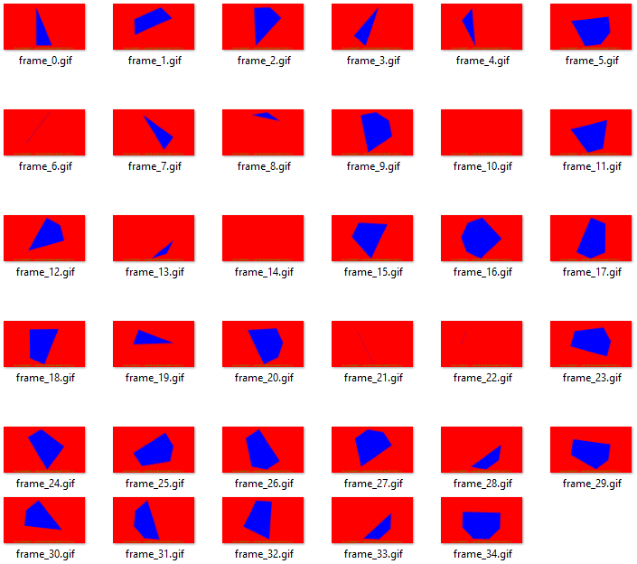
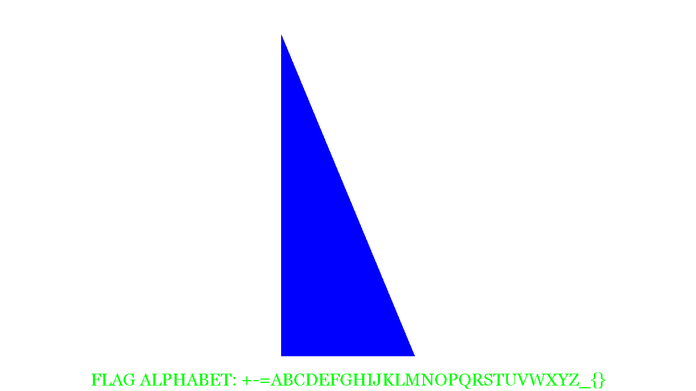
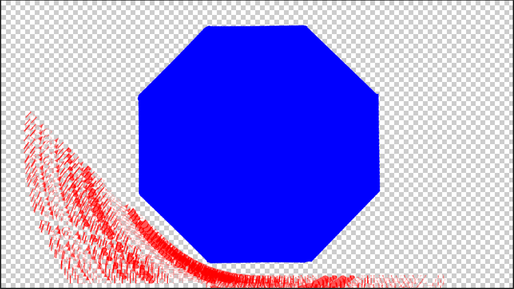
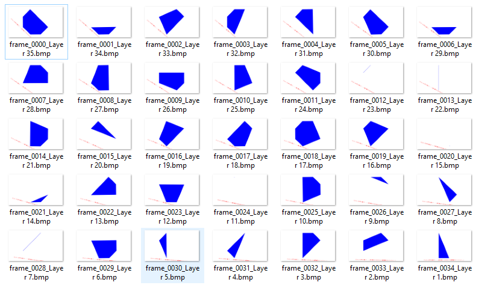
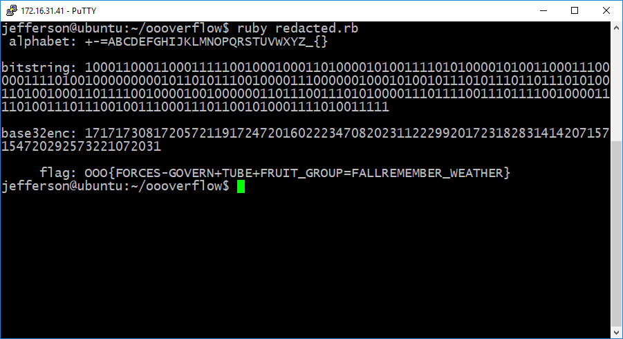

|Info   |                             |
---------|:---------------------------:|
Event    |Oooverflow Defcon Quals 2019 |
Challenge|redacted-puzzle              |
Solvers  |l4cr0ss,muttontastic         |
Writeup  |l4cr0ss                      |
Date     |2019-05-12                   |

The challenge is to extract a flag from this .gif:

The header of the .gif appears well-formed, but you can see that the global color table has three of its four colors set to black. Rewriting the GCT with some color produces a more sensible gif, numbering 35 frames in total.

|Original color table; first three colors == rgb(0,0,0)|Modified table; rgb(255,0,0), rgb(0,255,0), rgb(0,0,255)|
:---------:|:---------------------------:|
|

`convert -coalesce redacted-puzzle5.gif frame_%d.gif` will split the gif into frames, one per file:  
  

We continue by making the background of each frame transparent by setting the transparent color flag and selecting the appropriate transparent color index in the graphic control extension for each embedded frame. From the resulting animation we can see that each subsequent frame is offset from the previous by an arbitrary degree of rotation. Correcting for this rotation by hand and merging the frames together reveals 8 unique vertices from which each figure is composed. 

|Animation with transparency enabled|Frames overlaid revealing octagon|
:---------:|:---------------------------:|
|  

|Animation with transparency enabled|
:---------:|
  

From here the key observation to make is that the custom flag alphabet embedded in the frames is an appropriate base32 encoding, and that treating each of the frames as representing eight bits (one for each possible vertex) gives an even number of base32-decoded characters. 

Starting at the topmost vertex of the first frame and proceeding clockwise to the last frame*, we generate a bit-string by returning 1 when the point is present and 0 when the point is absent, where present/absent means the vertex is included in the figure shown in a given frame. 

This string, base32 encoded and used as an index into the flag alphabet, gives the flag.

*_it was known beforehand that the flag must begin with the sequence OOO{… and starting at any other point resulted in an invalid flag_

